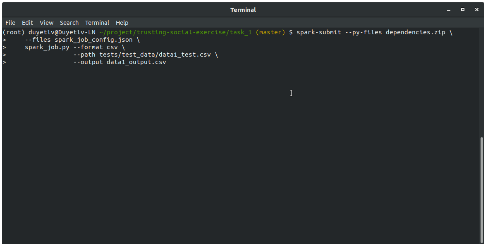
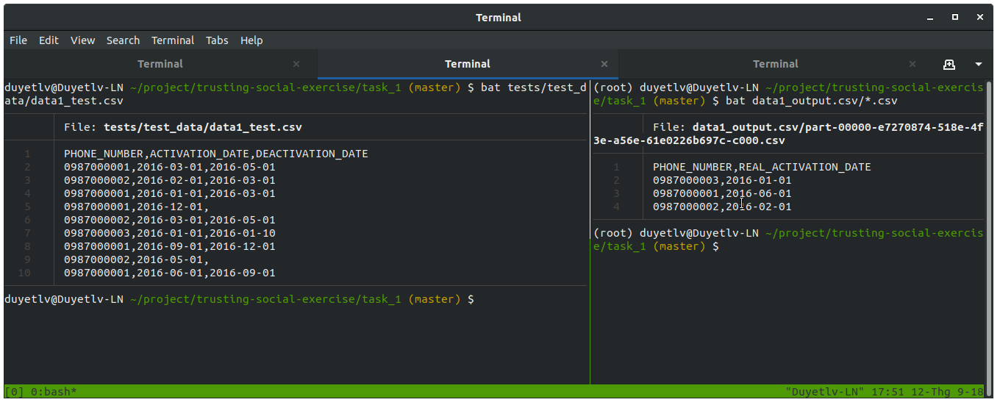

# Task 1 [Algorithm and coding]: Find the actual activation date of a phone number

*LE Van-Duyet (me@duyet.net)*

## Strategy and algorithm 

Assumming that you have data input DataFrame

```
+------------+---------------+-----------------+
|PHONE_NUMBER|ACTIVATION_DATE|DEACTIVATION_DATE|
|  0987000001|     2016-03-01|       2016-05-01|
|  0987000002|     2016-02-01|       2016-03-01|
|  0987000001|     2016-01-01|       2016-03-01|
|  0987000001|     2016-12-01|             null|
|  0987000002|     2016-03-01|       2016-05-01|
|  0987000003|     2016-01-01|       2016-01-10|
|  0987000001|     2016-09-01|       2016-12-01|
|  0987000002|     2016-05-01|             null|
|  0987000001|     2016-06-01|       2016-09-01|
+------------+---------------+-----------------+
```

1. Partition data by `PHONE_NUMBER` and sort by `ACTIVATION_DATE` in descending. 

2. Calculate `is_first_of_current_user` column.

- Assuming that `DEACTIVATION_DATE` of previous row EQUAL to `ACTIVATION_DATE` of current row, which mean the user change from prepaid plan to postpaid plan, or vice versa.
- `is_first_of_current_user` = TRUE if this row is the first activation date of current owner.
  `is_first_of_current_user := true` if `ACTIVATION_DATE == previous_row(DEACTIVATION_DATE)` 


```
+------------+---------------+-----------------+------------------------+
|PHONE_NUMBER|ACTIVATION_DATE|DEACTIVATION_DATE|is_first_of_current_user|
+------------+---------------+-----------------+------------------------+
|        ... |            ...|             ... |                    ... |
|  0987000001|     2016-01-01|       2016-03-01|                    true|
|  0987000001|     2016-03-01|       2016-05-01|                   false|
|  0987000001|     2016-06-01|       2016-09-01|                    true|
|  0987000001|     2016-09-01|       2016-12-01|                   false|
|  0987000001|     2016-12-01|             null|                   false|
|        ... |            ...|             ... |                    ... |
+------------+---------------+-----------------+------------------------+
```

3. Filter `is_first_of_current_user == true`

```
+------------+---------------+-----------------+------------------------+
|PHONE_NUMBER|ACTIVATION_DATE|DEACTIVATION_DATE|is_first_of_current_user|
+------------+---------------+-----------------+------------------------+
|        ... |            ...|             ... |                    ... |
|  0987000001|     2016-01-01|       2016-03-01|                    true|
|  0987000001|     2016-06-01|       2016-09-01|                    true|
|        ... |            ...|             ... |                    ... |
+------------+---------------+-----------------+------------------------+
```

4. Pick the latest row by `ACTIVATION_DATE` by ranking descending, we got `ACTIVATION_DATE` as `REAL_ACTIVATION_DATE` 

```
+------------+--------------------+
|PHONE_NUMBER|REAL_ACTIVATION_DATE|
+------------+--------------------+
|        ... |                 ...|
|  0987000001|          2016-06-01|
|        ... |                 ...|
+------------+--------------------+
```

## Project structure

```
.
├── spark_job.py
├── spark_job_config.json
├── README.md
├── run_submit.sh
├── tests
│   ├── __init__.py
│   ├── test_data
│   │   ├── data1_test.csv
│   │   ├── data1_validation.csv
│   │   └── ...
│   └── test_spark_job.py
└── utils
    ├── __init__.py
    └── logger.py
```

- `spark_job.py`: main module which will be sent to the Spark cluster.
- `spark_job_config.json`: external configuration parameters required by `spark_job.py`, stored in JSON format.
- `run_submit.sh`: a bash script for submit to spark cluster.
- `utils/`: additional modules that support spark job.
- `tests/`: Unit test modules, includes `test_data` folder.

## Submit the job 

Assuming that:

- The `$SPARK_HOME` environment variable points to your local Spark installation folder.
- You install spark in local.

From this folder, build dependencies (zip all python files: `zip -r dependencies.zip *`) and submit to Spark:

```sh
$SPARK_HOME/bin/spark-submit \
    --master local[*] \
    --py-files dependencies.zip \
    --files spark_job_config.json \
    spark_job.py --format csv \
                 --path tests/test_data/data1_test.csv \
                 --output data1_output.csv
```

```
usage: spark_job.py [-h] [--format FORMAT] [--path PATH] [--output OUTPUT]
                    [--debug]

Find real activation date

optional arguments:
  -h, --help       show this help message and exit
  --format FORMAT  format of input file: csv or parquet
  --path PATH      path of input data set (e.g.
                   file:///home/duyetdev/data.csv, hdfs:///data.csv)
  --output OUTPUT  path of input data set (e.g.
                   file:///home/duyetdev/output.csv, hdfs:///output.csv)
  --debug          turn on debug mode
```

Modify the `--master` option with your Spark IP (either in single-executor mode locally or something larger in the cloud) - e.g. `--master spark://localhost:7077`

See example at `run_submit.sh`



Input and output:


## Run test
Only test the `process_data` function due to lack of time. Append `task_1` folder to your `PYTHONPATH`, make sure you have installed `pyspark`, `py4j` and `pytest` packages.

Then, execute following commands in root directory:
```
$ PYTHONPATH="$PYTHONPATH:/path/to/task_1/folder" pytest

====== test session starts ======
platform linux -- Python 3.6.3, pytest-3.2.1, py-1.4.34, pluggy-0.4.0
rootdir: /home/duyetlv/project/trusting-social-exercise/task_1, inifile:
plugins: spark-0.4.0
collected 1 item                                                                        

tests/test_spark_job.py .

====== 1 passed in 13.02 seconds ======
```

Test function will load `*_test.csv` file, processed with `process_data` then validate output with `*_validate.csv` file.

